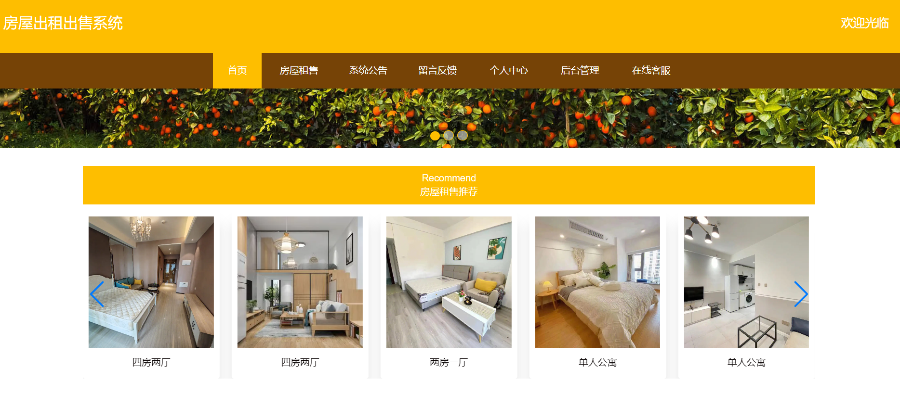
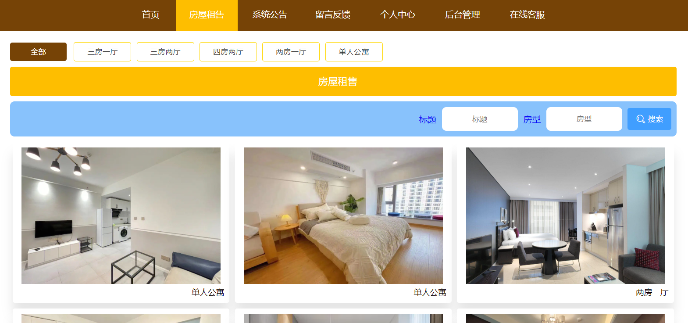
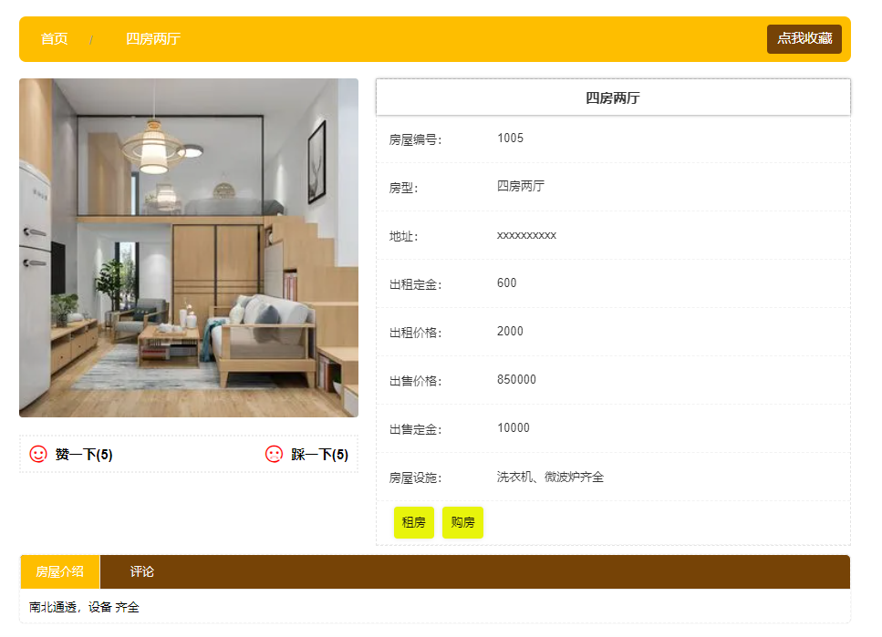
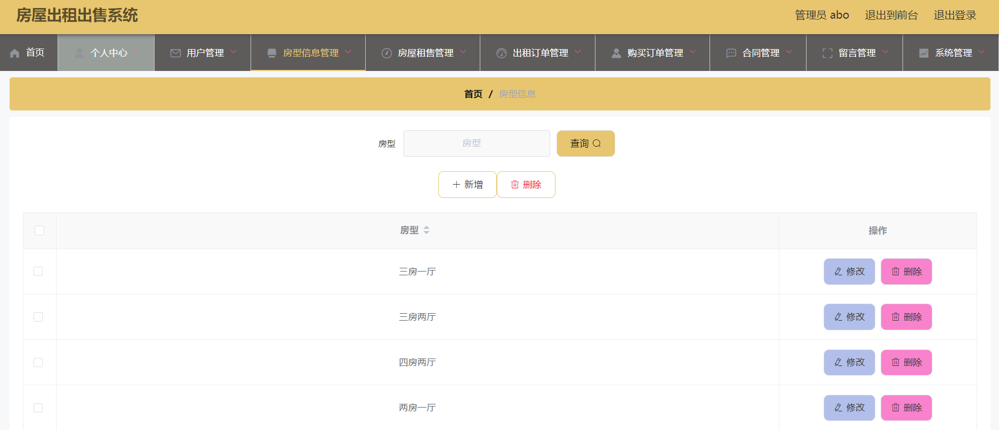
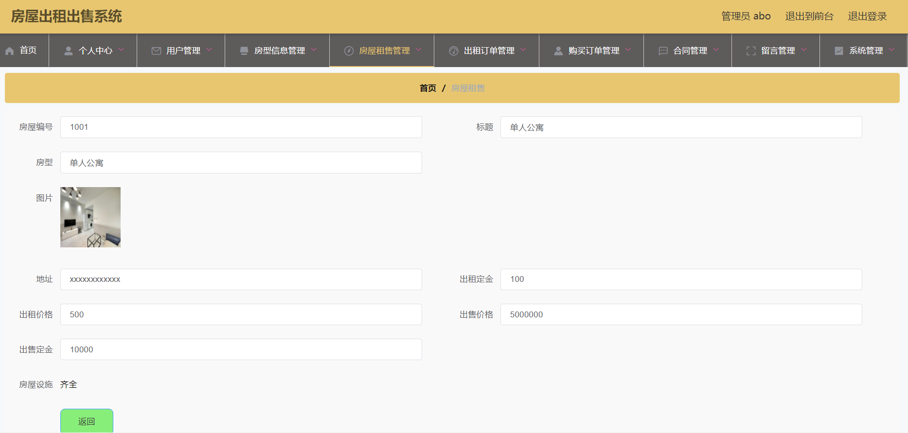

## 介绍
&emsp;&emsp;房屋租赁系统、房屋出租管理系统，前后端分离，毕业设计可以用来参考，具体功能如下图所示。

> 1. 后端技术：Spring+SpringMVC+MyBatis
> 2. 前端技术：Bootstarp+Vue.js+Layui
> 3. 数据库：MySQL
> 4. 软件：IDEA/Ecilpse
> 5. Q：**3119403249**

##  系统展示

&emsp;&emsp;系统角色分为管理员和用户，管理员登录本系统可以对个人信息、用户信息、房屋类型、房屋信息、出租订单、购买订单、轮播图、新闻公告、留言信息等进行管理。 用户注册登录本系统可以浏览本系统的房屋信息、可以按类查看、搜索房屋、修改个人信息、收藏、评论、留言、租房、购房等。

#### 系统首页

> 可以看到轮播图、导航栏目等信息。

#### 房屋租售

> 房屋租售可以按类查询、搜索等。

#### 房屋详情

> 用户可以收藏、租房、购房，并且可以看到详细的信息。

#### 管理员界面

